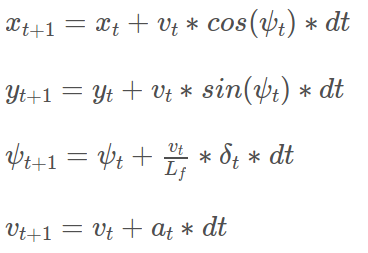

# MPC Controller
# Vehicle Model
The kinematic vehicle model is used in the simulation. The model is defined as:

# N & dt
The elapsed duration is set to 0.1s. The elapsed duration is set according to the time delay. The timestep length is set to only 10 steps to save computation time and predict enough trajectory.

# Polynomial Fitting and Preprocessing
The waypoints are fitted by a 3rd polynomial. The range of throttle is -1.0~+1.0. The throttle is transformed into acceleration by multiplying a ratio. The ratio is set to 40.0. That is, if the throttle is 1.0, the acceleration of the vehicle is 40.0m/ss. In this way, the mpc solver could predict state based on the acceleration not on the throttle. The range of steer is -1.0~+1.0. The range of the front wheels is -25.0~+25.0deg. The steer is constrained to -25.0~+25.0 in the mpc solver.

# Latency
To account for the control latency, the state is forward predicted 0.1s supposing the steer and throttle is not changed during the 0.1s latency. The predicted state is fed into the mpc solver.

